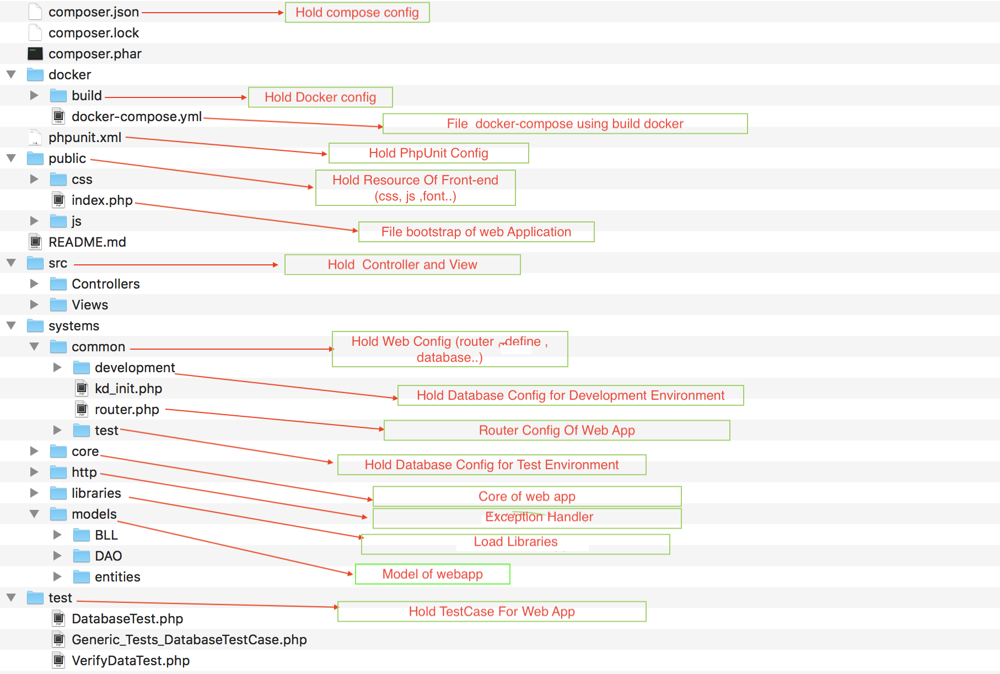
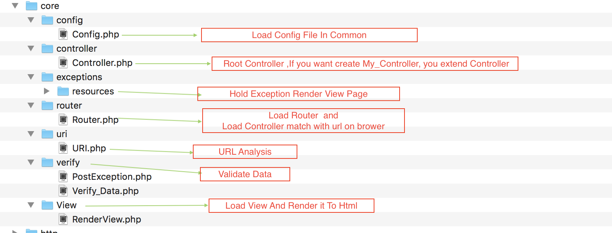

# Mywork Project
A web system to manage your work named.
- Description Global 

- Description Core 

## Requirement

  - Apache 2.4
  - Mysql 5.6 - 5.7
  - php-7.0
  - php-unit 6.5
  - db-unit 3.0
  
**Note:** Install php-70 with these library:  
sudo yum install php70 \
php7-pear \
php70-cli \
php70-common \
php70-intl \
php70-json \
php70-mbstring \
php70-mcrypt \
php70-mysqlnd \
php70-pdo \
php70-pecl-apcu \
php70-pecl-imagick \
php70-process \
php70-xml \
php70-gd \
php70-opcache

## For develop environment
###### 1. Install docker native and start docker app
**`https://docs.docker.com/docker-for-mac/install`**
###### 2. Clone source code from Git into your computer. 
  - Because default docker native just share folder on user folder, for ignore potential error, you can clone source into folder inside home user folder, Example: /Users/username/mywork 
  - After clone and checkout develop branch

###### 3. Check port
Before run docker, please check port 8080, 443, 3309 on your machine, if these ports are open, please turn them off for ignore conflict port when run docker
###### 4. Using terminal to access root source folder 
**`/Users/username/mywork`** 
###### 5. Run: 
Change the current working directory to docker : **`cd docker`**
 
Run docker-compose.yml : **`docker-compose up -d`** and wait docker build image
###### 6. After docker build success, you can check container start success by run **`docker ps -a`**
###### 7. Develop environment of dss using 3 container:
 - App server container (link to port 8080 and 443 )
 - Mysql Database container ( link to port 3309 ) Mysql user is: root / password
 - Selenium container (link to port 4444)

###### 9. Sync database 
  - You can open database up with MySQL Workbench which is GUI Migration tool of MySQL.
  - Sync database schema with your local MySQL Server.
  - UserAccount : root
  - Password : root
  - Port : 127.0.0.1 : 3309
 
###### 10. Config php develop environment in source:
  - Open folder **`{root_src}/systems/common/development/`**
  - Change connect info variable in **`{root_src}/systems/common/development/config.php`**
    - type => mysql,
    - host => mysql,
    - schema => my_work,
    - user => root,
    - pass => root,
    - charset => utf8, 

###### 11. Config router in source:
  - Open folder **`{root_src}/systems/common/`**
  - Change connect info variable in **`{root_src}/systems/common/router.php`** . In array $router:
    - $router['controller'] : is mapping of Controller. Controller have suffix: **`_Controller`**
    - $router['controller'] is array hold: 
        - key : is url of action 
        - value : is action
    
###### 12. Access local website at: `http://localhost:8080`

###### 13. How to write and run unit test:
This project using **PHPUNIT** for auto_testing environment

Testcase is written at **`{root_src}/test`** folder

**Run unit test by:** 
  - Change the current working directory to docker **`cd docker`** 
  - Access docker container **`docker-compose exec web bash`**
  - Change the current working directory to web **`cd web`**
  - Run: **`vendor/bin/phpunit --filter=TestCaseYouWantRun`**
 

###### 14. Using git-flow to contribute your code
http://nvie.com/posts/a-successful-git-branching-model/

Open browser and go to page: **`http://localhost:8080`**